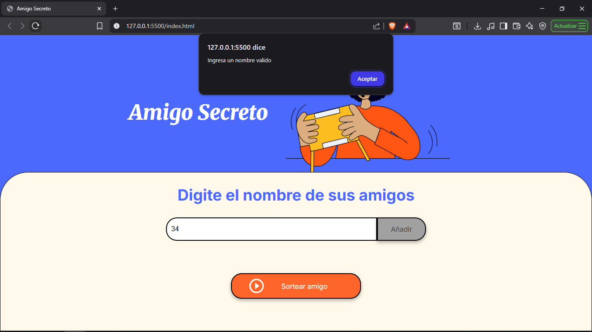

<h1 align="center"> Proyecto amigo secreto </h1>

## Índice

* [Propósito](propósito-del-proyecto)
* [Uso del sistema](#uso-del-sistema)
* [Funciones del sistema](#funciones-del-sistema)
* [Descripción detallada](#descripción-detallada)
* [Demostración](#demostración)
* [Limitaciones](#limitaciones)
* [Autor](#autor)

## Propósito del proyecto
El próposito del proyecto es implemntar un sistema funcional de selección aleatoria de un nombre entre los ingresados por el usuario.

## Uso del sistema
Para ejecutar el sistema solo es necesario descargar los archivos y ejecutar el archivo `HTML` en el navegador.
También puedes visitar [Mi GitHub Page](https://johanmrg.github.io/Proyecto-amigo-secreto/) como alternativa.

## Funciones del sistema
La página es un sistema de sorteo simple, contruido mediante `html`, `css` y `Js` que tiene las siguientes funciones:

- `Ingreso de nombres`: El usuario puede ingresar nombres a su gusto, mismos que se muestrasn en forma de lista.
- `Verificación de datos ingresados`: el sistema realiza una verifiación de los datos ingresados, comprobando que solo se ingresen nombres.
- `Sorteo de nombres`: mediante calculos matemáticos los datos ingresados se sortean y se selecciona solo uno. Esta selección se muestra en pantalla.

## Descripción detallada

- **Ingreso de nombres**
  - El usuario puede usar el `input` para ingresar un nombre.
  - Al hacer click en el boton «Añadir», se ejecutara una `function`, la cual, mediante un bucle `for`, añadirá el nombre a una lista `html`, por lo que se mostrara en la parte inferior del `input`.
  - A su vez, la acción anterior provocará que el nombre se ingrese en un `array` y que la celda del `input` se vacíe.
  - Durant la acción de pulsar el boton «Añadir», sucede unua verificación intena mediante un `test`. Esta determina que el dato ingresado no está vació, además de que contenga solo texto. En caso de que lo ingresado no cumpla las condciones, no se registrará y un `alert` pedirá un dato correcto.

- **Sorteo**
  - AL pulsar el boton «Sortear amigo», una `function` genera un numero aleatorio entre cero y la cantidad de datos ingresados mediante `Math.random`.
  - El numero generado pasa a convertirse en una variable, posteriormente, esta será usada para sleccionar el dato que corresponda con esa posición númerica en el `array`.
  - Una vez que esto sucede, la lista de nombres se elimina y el nombre selccionado pasara a mostrarse en un `html` color verde debajo del `input`.

## Demostración

## Limitaciones
- El sistema no fue pensado para sortear varias veces los mismos nombres. Una vez que se pulsa el botón de «Sortear amigo», estos se eliminan del `array`, por lo tanto, es aconsejable usarlo de esa manera. Con ciertas adecuaciones podría cumplir esa función, pero en este caso no se solicitó.
- A falta de un botón de reset, si quieres volver a usar el sistema, tienes dos opciones: recargar la página o pulsar de nuevo el botón «Sortear amigo». En la práctica, ambas opciones tienen el mismo efecto.

## Autor
### Johan Ruiz

